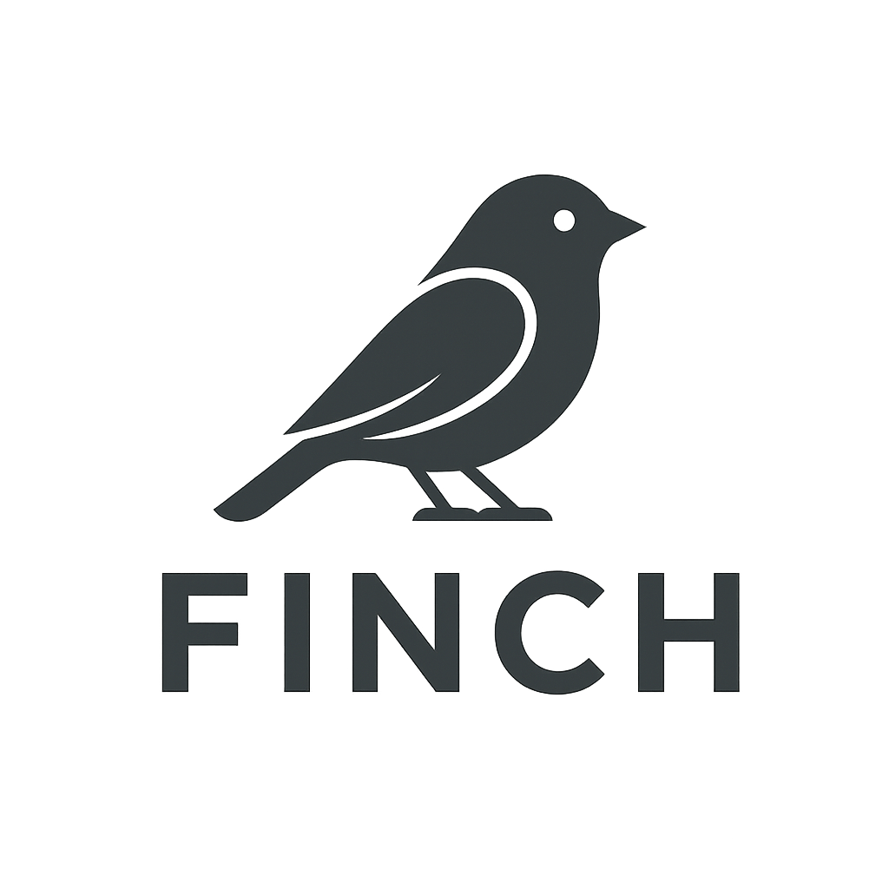

<p align="center">
  
</p>

# 🪶 Finch

**Finch** is a minimal and lightweight framework for building RESTful APIs in pure **Lua**.  
It provides a simple routing system, clean abstractions for handling requests and responses,  
and is lightweight enough to embed in any Lua environment (e.g., OpenResty, Nginx).

---

## ✨ Features

- 🧩 Minimal and dependency-free  
- ⚙️ Simple route registration: `GET`, `POST`, etc.  
- 🪶 Lightweight request and response helpers  
- 🔥 Works with Nginx/OpenResty (`ngx`)
- 🧠 Easy to extend with middleware and hooks  

---

## 🚀 Installation

You can install **Finch** directly from [LuaRocks](https://luarocks.org):

```bash
luarocks install finch
```

Or clone manually: 

```
git clone https://github.com/yourusername/finch.git   
cd finch   
luarocks make   
``` 

---

## 🧰 Example Usage
```
local fw = require("framework")

local function controller(req, resp)
        resp.header("name", "ali")
        resp.body("Hello dear")
end

fw.route("/", "GET", controller)

fw.start()
```

test : 
```shell
# apt install httpie curl
# use curl
> curl -s -X POST http://localhost:8080/ 
Hello dear

# use http 
> http GET http://localhost:8080/
HTTP/1.1 200 OK
Connection: keep-alive
Content-Type: application/json; charset=utf-8
Date: Fri, 17 Oct 2025 16:16:09 GMT
Server: openresty/1.27.1.2
Transfer-Encoding: chunked
name: ali

Hello dear

```
